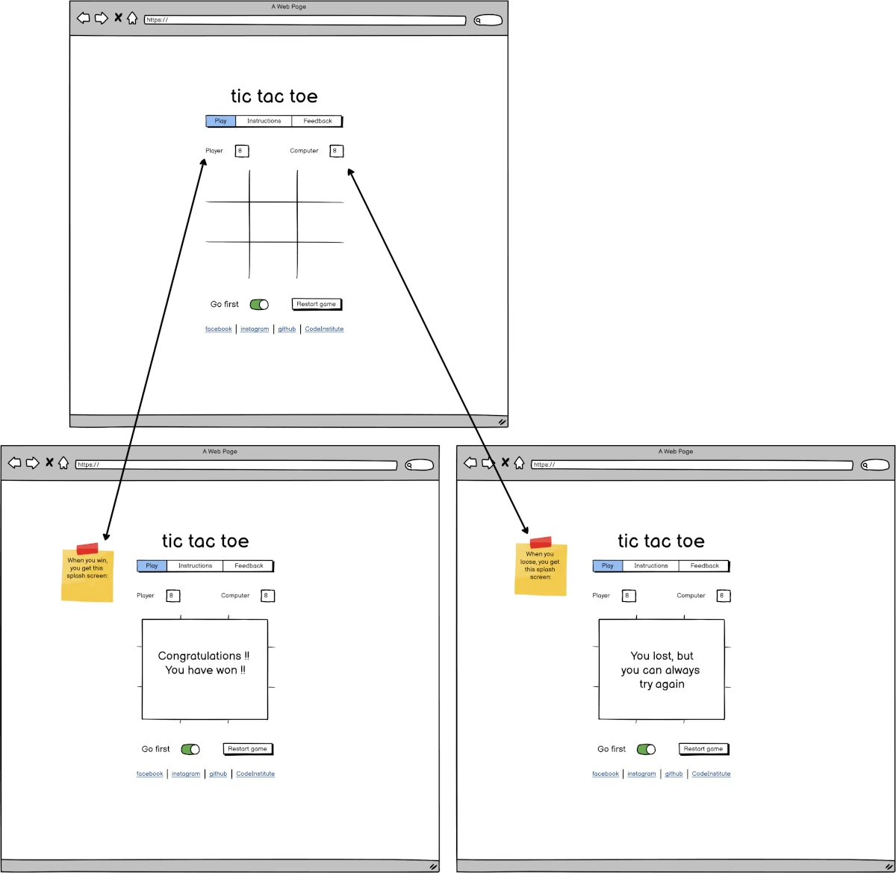

# tic tac toe

## Introduction

Welcome to my tic tac toe game. This is designed to be a mobile app first and a single page application.
We are using HTML5, CSS3 and JavaScript to create a fun to play game.

[Live website](https://kaospctqc.github.io/tic-tac-toe/).

## Table of Contents

-   [1. UX](#ux)
    -   [Wireframe](#wireframe)
    -   [Color scheme](#color-scheme)
-   [2. Features](#features)
-   [3. Technologies Used](#technologies-used)
-   [4. Testing](#testing)
-   [5. Deployment](#deployment)
-   [6. Credits](#credits)

## UX

## 1.1 Wireframe

Before implementing any html, css or javascript, we used [Balsamiq](https://balsamiq.com/) to create wireframes that describe the initial design of the application. This step help a lot when implementing the html, css and javascript.

### Home / Play page
{:height="50%" width="50%"}
{:height="50%" width="50%"}

### Instructions page
{:height="50%" width="50%"}
{:height="50%" width="50%"}

### Feedback page
{:height="50%" width="50%"}
{:height="50%" width="50%"}

## 1.2 Color Scheme

The color scheme influences the users state and the design choice was to try to achieve something calming, relaxing.
When searching for the color scheme, we used [coolors.co](https://coolors.co/ebede9-d2d4c8-b8bdb5-889696-5f7470) as a starting point.

The next tool used was [webaim.org](https://webaim.org/resources/contrastchecker/) that helped achieve a good level of contrast while maintaining the overall scheme that we wanted to use.

## Features

## Technologies Used

## Testing

## Deployment

## Credits
rules: https://www.exploratorium.edu/brain_explorer/tictactoe.html