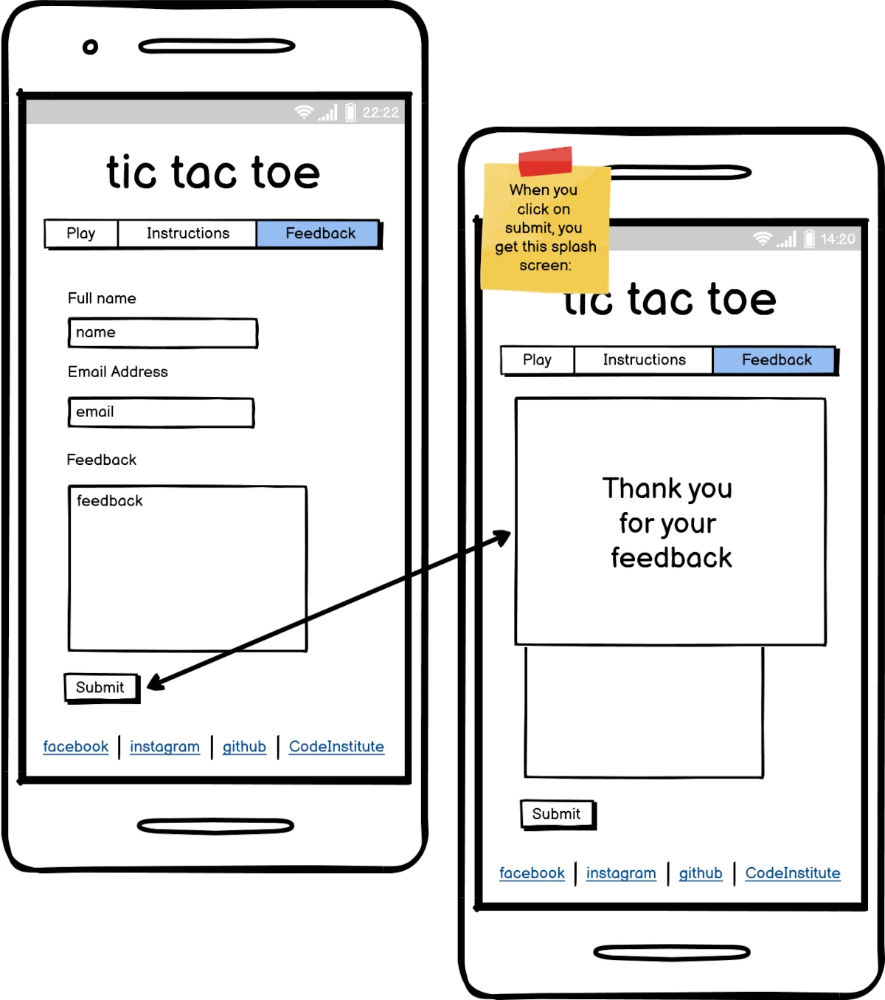

# tic tac toe

## Introduction

Welcome to my tic tac toe game. This is designed to be a mobile app first and a single page application.
We are using HTML5, CSS3 and JavaScript to create a fun to play game.

[Live website](https://kaospctqc.github.io/tic-tac-toe/).

## Table of Contents

-   [1. UX](#ux)
-   [2. Features](#features)
-   [3. Technologies Used](#technologies-used)
-   [4. Testing](#testing)
-   [5. Deployment](#deployment)
-   [6. Credits](#credits)

## 1. UX
[Go to the top](#table-of-contents)

This implementation of the tic tac toe game is meant to:
- allow users to play the game
- read instructions on how to play the game
- provide feedback using a form

There are some social media links provided in the footer to allow users to find information related to the author or this and other projects.

### 1.1 Wireframe

Before implementing any html, css or javascript, we used [Balsamiq](https://balsamiq.com/) to create wireframes that describe the initial design of the application. This step help a lot when implementing the html, css and javascript.

#### Home / Play page

#### Instructions page

### #Feedback page

### 1.2 Color Scheme

The color scheme influences the users state and the design choice was to try to achieve something calming, relaxing.
When searching for the color scheme, we used [coolors.co](https://coolors.co/ebede9-d2d4c8-b8bdb5-889696-5f7470) as a starting point.

The next tool used was [webaim.org](https://webaim.org/resources/contrastchecker/) that helped achieve a good level of contrast while maintaining the overall scheme that we wanted to use.

## 2. Features
[Go to the top](#table-of-contents)

The app features 3 distinct areas: 
- the header that hosts the main title of the app and the main navigation menu
- the main section that will show one of the 3 pages depending of where the user navigated
    - the game (Play), 
    - how to play (Instructions), 
    - contact form (Feedback).
- the footer that has social media links

### the header
The name of the app is the largest text. 
The menu highlights the current location and also signals when mouse over to indicate that it is a active element and can be pressed.

### the game (Play)
All elements will reset once the Restart game button has been pressed or the user navigated to a different location or on page refresh.
The game section starts with showing the current score. 
The game board where the user may add marks during a round of the game.
The settings section where the user can select who should start the round (the user or the computer). 
Currently, the computer moves are random.
The Restart game button that allows the user to start over.

### instructions
A simple, unordered list of instructions meant to tell the user the basic rules of tic-tac-toe.

### contact form
A Name, Email and TextArea form that the user can use to send feedback to the maintainer of the app. Currently sending to [formdump](https://formdump.codeinstitute.net/)

### footer
Container for social media links that can be used by to user to find information about the author, other projects by the author, code institute.

## 3. Technologies Used
[Go to the top](#table-of-contents)

- [Balsamiq](https://balsamiq.com/) wireframes software
- [coolors.co](https://coolors.co/) color schemas generator
- [webaim.org](https://webaim.org/resources/contrastchecker/) constrast checker
- [HTML5](https://en.wikipedia.org/wiki/HTML5) structure and some content for the app
- [CSS3](https://en.wikipedia.org/wiki/CSS) style and some behaviour
- [amIResponsive](http://ami.responsivedesign.is/) generate screenshots for various screen sizes
- [JavaScript](https://en.wikipedia.org/wiki/JavaScript) dynamic content behaviour
- [Google Fonts](https://fonts.google.com/) originally selected Roboto Mono and Zen Kurenaido but only the second one was actually used.
- [Firefox browser](https://www.mozilla.org/) used to preview, inspect and test 
- [Github](https://github.com/) code repository and versioning
- [Gitpod](https://www.gitpod.io/) developer environment
- [W3C HTML Validation](https://validator.w3.org/) check HTML code
- [W3C CSS Validation](https://jigsaw.w3.org/css-validator/) check CSS code
- [JavaScript validation](https://jshint.com/) check JavaScript code

## 4. Testing
[Go to the top](#table-of-contents)

## 5. Deployment
[Go to the top](#table-of-contents)

## 6. Credits
[Go to the top](#table-of-contents)

rules: https://www.exploratorium.edu/brain_explorer/tictactoe.html